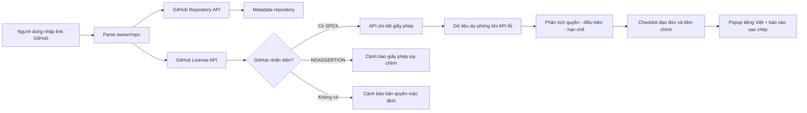

# ⚖️ Việt Hóa Có Trách Nhiệm

> **Công cụ kiểm tra giấy phép, ranh giới đạo đức và liêm chính trước khi Fork, sao chép, Việt hóa hoặc phân phối một repository GitHub.**

[](https://base27-cvnss.github.io/viethoa/)
[](LICENSE)
[](#)
[](#)
[](ETHICS.md)

## 🌐 Công cụ trực tuyến

**GitHub Pages:** `https://base27-cvnss.github.io/viethoa/`

Nhập một link như:

```text
https://github.com/facebook/react
facebook/react
```

Công cụ sẽ mở popup tiếng Việt để cho biết:

- Giấy phép và mã SPDX GitHub nhận diện.
- Có được sửa đổi hoặc Việt hóa hay không.
- Có được phân phối và thương mại hóa hay không.
- Nghĩa vụ ghi công, giữ `LICENSE`, `NOTICE`, đánh dấu thay đổi.
- Nghĩa vụ copyleft ở mức dự án, thư viện, file hoặc sử dụng qua mạng.
- Những quyền **không nên suy diễn**, như nhãn hiệu, bằng sáng chế, model, dữ liệu và nội dung đi kèm.
- Checklist liêm chính trước khi tạo fork.

---

## 🎯 Vì sao dự án này tồn tại?

Fork và copy code chỉ mất vài giây. Hiểu đúng quyền sử dụng và trách nhiệm có thể mất nhiều giờ.

Một repository công khai **không đồng nghĩa** với việc mọi người được tự do sửa, bán hoặc phát hành lại. Giấy phép là lời tuyên bố cho biết người khác được làm gì với mã nguồn. Khi không có giấy phép, luật bản quyền mặc định vẫn áp dụng; GitHub cũng lưu ý rằng người khác không mặc nhiên được tái tạo, phân phối hoặc tạo tác phẩm phái sinh ngoài các quyền nền tảng cho phép.

Dự án biến việc đọc giấy phép thành một bước kiểm tra quen thuộc trước khi:

1. Fork repository.
2. Sao chép code.
3. Dịch giao diện hoặc README.
4. Đổi tên và logo.
5. Đóng gói file cài đặt.
6. Bán sản phẩm hoặc cung cấp SaaS.
7. Dùng code trong bài báo, đồ án hoặc tài liệu học thuật.

> **Việt hóa là mở một cánh cửa, không phải xóa tên người đã xây ngôi nhà.**

---

## 🧭 Tuyên bố đạo đức, liêm chính và học thuật

Chúng tôi tin rằng mã nguồn mở được duy trì bằng **niềm tin**. Người sử dụng nhận được quyền từ tác giả gốc, nhưng cũng nhận một nghĩa vụ: bảo toàn giấy phép, ghi công trung thực, minh bạch thay đổi và không gây hiểu nhầm về nguồn gốc.

Dự án phân biệt rõ bốn vai trò:

| Vai trò | Đóng góp |
|---|---|
| **Tác giả/dự án gốc** | Thiết kế, kiến trúc, mã nguồn hoặc nội dung nguyên bản |
| **Người Việt hóa** | Dịch giao diện, thuật ngữ, tài liệu và bản địa hóa |
| **Người bảo trì fork** | Đồng bộ upstream, sửa lỗi, bảo mật, phát hành |
| **Người phát triển mới** | Viết tính năng, thuật toán hoặc thành phần mới |

Mỗi vai trò đều đáng được ghi nhận. Người Việt hóa không thay thế tác giả gốc; người bảo trì fork không được che giấu lịch sử; người dùng AI vẫn chịu trách nhiệm đối với nội dung mình commit.

Đọc tuyên bố đầy đủ tại [`ETHICS.md`](ETHICS.md).

---

## 🏔️ Trăn trở về trẻ em vùng sâu, vùng xa và vùng núi

Trong khi nhiều nơi nói về Agent AI, robot và tự động hóa, vẫn có trẻ em chỉ tiếp cận được máy tính cũ, đường truyền yếu và tài liệu ngoại ngữ khó hiểu. Một công cụ HTML nhẹ, không cần cài đặt, có thể là cánh cửa đầu tiên để các em:

- Hiểu máy tính không chỉ là thiết bị giải trí.
- Đọc tài liệu công nghệ bằng tiếng Việt.
- Học cách tôn trọng quyền tác giả ngay từ dòng code đầu tiên.
- Đi từ sử dụng phần mềm đến hiểu kiến trúc, sửa lỗi và tự sáng tạo.
- Biết đóng góp ngược cho cộng đồng thay vì chỉ sao chép.

Mục tiêu xã hội không phải giấy phép để bỏ qua quyền tác giả. Trái lại, giúp trẻ em tiếp cận công nghệ phải đi cùng việc dạy **lòng biết ơn, tính trung thực và trách nhiệm số**.

---

## ✅ Quy trình 7 bước trước khi Fork

1. **Xác định đúng upstream:** chủ sở hữu, website, lịch sử commit và release.
2. **Đọc giấy phép:** `LICENSE`, `NOTICE`, `COPYING`, `AUTHORS`, `TRADEMARK`.
3. **Xác định hành vi:** dùng riêng, sửa, phân phối, bán, SaaS hay nhúng thư viện.
4. **Lập hồ sơ ghi công:** nguồn gốc, phiên bản/commit nền, giấy phép, ngày fork.
5. **Tách phần đóng góp:** bản dịch, mã sửa và mã mới phải minh bạch qua commit/CHANGELOG.
6. **Ưu tiên Pull Request upstream:** đặc biệt khi dự án đã hỗ trợ i18n.
7. **Rà soát trước release:** copyleft, source offer, dependency, model, dữ liệu và bảo mật.

---

## 🔎 Những gì công cụ kiểm tra

### 1. Metadata repository

Công cụ gọi:

```http
GET https://api.github.com/repos/{owner}/{repo}
```

### 2. File giấy phép được GitHub nhận diện

```http
GET https://api.github.com/repos/{owner}/{repo}/license
```

### 3. Dữ liệu chi tiết của giấy phép

```http
GET https://api.github.com/licenses/{license-key}
```

GitHub sử dụng **Licensee** để so khớp file giấy phép với một tập giấy phép đã biết. Vì vậy, kết quả không bao phủ toàn bộ license của dependency, thư mục con, model AI, dataset hoặc các quyền được mô tả ở nơi khác.

### 4. Dữ liệu dự phòng

Nếu API chi tiết bị giới hạn, trang có dữ liệu tóm tắt dự phòng cho:

- MIT
- Apache-2.0
- BSD-2-Clause
- BSD-3-Clause
- GPL-2.0 / GPL-3.0
- LGPL-2.1 / LGPL-3.0
- MPL-2.0
- AGPL-3.0
- EUPL-1.2
- Unlicense
- CC0-1.0

---

## 🟢🟡🔴 Cách đọc kết quả

| Trạng thái | Ý nghĩa thực hành |
|---|---|
| **Có** | Giấy phép liệt kê quyền tương ứng |
| **Có điều kiện** | Được thực hiện nhưng phải hoàn thành nghĩa vụ ghi công, source hoặc copyleft |
| **Không rõ** | API không đủ dữ liệu; phải đọc thủ công |
| **Không phát hiện LICENSE** | Không nên sao chép, sửa đổi, phân phối hoặc thương mại hóa nếu chưa được cấp quyền |
| **NOASSERTION / Other** | Có file license nhưng GitHub không xác định được SPDX; cần đánh giá nội dung thủ công |

---

## ⚠️ Ranh giới vùng xám

### Repository công khai không có LICENSE

Nút Fork không tự biến repository thành phần mềm nguồn mở. Hãy liên hệ chủ sở hữu hoặc tìm dự án thay thế có giấy phép rõ ràng.

### Đổi tên và logo

License code không mặc nhiên cấp quyền dùng nhãn hiệu. Đổi logo cũng không xóa nghĩa vụ ghi công hoặc lịch sử.

### Bản dịch README

Bản dịch là một phần nội dung phái sinh. Ghi nguồn, người dịch và license tài liệu nếu có.

### SaaS và sử dụng qua mạng

GPL, AGPL và EUPL có phạm vi nghĩa vụ khác nhau. Đừng kết luận chỉ dựa vào việc bạn không gửi file cài đặt.

### Model AI, dataset và nội dung đa phương tiện

License của code không tự động bao phủ model weight, dataset, hình ảnh, giọng nói, font hoặc dữ liệu cá nhân.

### Code do AI hỗ trợ

Người commit vẫn phải rà soát tính đúng đắn, bảo mật, nguồn gốc và tương đồng. “AI viết” không phải là miễn trừ trách nhiệm.

---

## 🏗️ Kiến trúc



### Đặc điểm kỹ thuật

- Một file `index.html`.
- HTML, CSS và JavaScript thuần.
- Không có backend.
- Không cần build.
- Không lưu lịch sử repository.
- Không yêu cầu GitHub token.
- Hỗ trợ desktop và thiết bị di động.
- Có fallback clipboard.
- Có modal hỗ trợ bàn phím và `aria`.

---

## 🔐 Quyền riêng tư và giới hạn API

Trang gửi yêu cầu trực tiếp từ trình duyệt đến `api.github.com`. Dự án không có máy chủ trung gian để thu thập link bạn nhập.

GitHub API công khai có giới hạn request theo IP. Khi bị giới hạn, công cụ hiển thị cảnh báo. Không nhập token cá nhân vào bản public của trang.

---

## 🚀 Chạy cục bộ

Cách đơn giản nhất:

```bash
git clone https://github.com/Base27-CVNSS/viethoa.git
cd viethoa
```

Mở `index.html` bằng Chrome, Edge hoặc Firefox.

Có thể dùng local server:

```bash
python -m http.server 8080
```

Sau đó mở:

```text
http://localhost:8080
```

---

## 🌍 Xuất bản GitHub Pages

Repository có workflow tại:

```text
.github/workflows/pages.yml
```

Workflow triển khai website tĩnh từ nhánh `main` bằng GitHub Actions. Nếu Pages chưa được bật, vào:

```text
Settings → Pages → Build and deployment → Source → GitHub Actions
```

Sau đó chạy lại workflow **Deploy GitHub Pages**.

---

## 🤝 Đóng góp

Đọc [`CONTRIBUTING.md`](CONTRIBUTING.md) trước khi gửi Pull Request.

Các đóng góp được khuyến khích:

- Sửa diễn giải giấy phép dựa trên nguồn chính thức.
- Bổ sung giấy phép hoặc mã SPDX.
- Cải thiện khả năng tiếp cận.
- Tối ưu cho máy cấu hình thấp.
- Viết tài liệu cho giáo viên và người mới học.
- Dịch thuật ngữ theo cách dễ hiểu nhưng không làm sai nghĩa pháp lý.

Không chấp nhận:

- Xóa credit hoặc tuyên bố sai nguồn gốc.
- Chèn tracker, quảng cáo hoặc telemetry không minh bạch.
- Đưa token/API key vào source.
- Biến công cụ thành kết luận pháp lý tuyệt đối.
- Dùng hoàn cảnh của trẻ em hoặc mục tiêu cộng đồng để hợp thức hóa vi phạm giấy phép.

---

## 📚 Nguồn tham khảo chính

- GitHub Docs — Licensing a repository  
  `https://docs.github.com/en/repositories/managing-your-repositorys-settings-and-features/customizing-your-repository/licensing-a-repository`
- GitHub REST API — Licenses  
  `https://docs.github.com/en/rest/licenses/licenses`
- GitHub Docs — Custom workflows with GitHub Pages  
  `https://docs.github.com/en/pages/getting-started-with-github-pages/using-custom-workflows-with-github-pages`
- Choose a License  
  `https://choosealicense.com/`
- SPDX License List  
  `https://spdx.org/licenses/`

---

## ⚖️ Miễn trừ trách nhiệm

Công cụ là tài liệu hướng dẫn kỹ thuật và đạo đức nghề nghiệp, **không phải tư vấn pháp lý**. Giấy phép có thể thay đổi theo phiên bản, jurisdiction, cách liên kết, hình thức phân phối, dependency và thỏa thuận riêng. Với dự án có giá trị thương mại hoặc rủi ro cao, hãy tham vấn luật sư phù hợp.

---

## 📄 Giấy phép của dự án này

Mã nguồn của công cụ được phát hành theo [MIT License](LICENSE).

Nội dung tuyên ngôn nhấn mạnh một nguyên tắc đơn giản:

> **Kiểm tra trước khi lấy. Ghi công trước khi công bố. Đóng góp lại khi có thể.**
